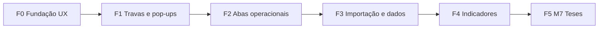

# Plano de execução — Briefing V2 (04/05)

> Base: `BRIEFING_DEV_REUNIAO_04-05_V2.md`  
> Auditoria: confrontação código × briefing (maio/2026)  
> Objetivo: fechar lacunas entre **fundação M0 (schema/API)** e **produto operacional (UI + regras completas)**

---

## 1. Estado atual (resumo)

| Camada | Cobertura estimada | Observação |
|--------|-------------------|------------|
| Schema / migrations | ~85% | Tabelas principais existem |
| API / serviços | ~55% | Derivação de fase, Comunica, sentença 1:N, ausentes |
| UI / fluxos | ~35% | Abas existem; muitas ainda mínimas ou stub |
| Indicadores | ~25% | Dashboards básicos; sem financeiro/sucumbência |

**Já corrigido recentemente:** coluna Situação = `qualidade_caso`; Sentença = `sentenca`; PROJUDI nas opções de sistema.

---

## 2. Princípios do plano

1. **Backend antes de UI** quando a regra é nova; **UI antes de indicadores** quando a regra já existe na API.
2. **Um fluxo vertical por vez** (ex.: sentença completa: API trava → modal → lista → sync procedentes).
3. **Não bloquear M0** com M7 (Banco de Teses fica em fase final).
4. Cada entrega deve ter **critério de aceite** testável (manual ou e2e).

---

## 3. Fases e prioridades

| Fase | Nome | Prazo sugerido | Foco |
|------|------|-----------------|------|
| **F0** | Fundação UX | 1–2 sprints | Drawer/modal, timeline, menu, observações |
| **F1** | Travas e pop-ups | 2–3 sprints | Sentença, audiência, improcedência, AVALIAR, fase |
| **F2** | Abas operacionais | 2–3 sprints | Recursos, Improcedentes, Procedentes, Pendências, Agenda |
| **F3** | Importação e dados | 1–2 sprints | Semáforo completo, adversário, ausentes, comarcas |
| **F4** | Indicadores | 1–2 sprints | Dashboards, audit UI, Comunica config |
| **F5** | M7 (opcional) | backlog | Banco de Teses |

---

## 4. F0 — Fundação UX

**Briefing:** §2.1, §4.4, §7 itens 1–4  
**Meta:** detalhe do processo utilizável no dia a dia.

### F0.1 — Drawer / modal unificado

| # | Tarefa | Arquivos / área | Aceite |
|---|--------|-----------------|--------|
| F0.1.1 | Substituir stubs `processo-drawer.tsx` e `timeline-processo.tsx` por implementação real | `apps/web/components/drawers/` | Ao clicar em processo, painel lateral ou modal grande com seções |
| F0.1.2 | Unificar `ProcessoModal` e drawer (um componente base, dois layouts) | `intimacoes/_components/processo-modal.tsx` | Sem duplicação de campos; mesma fonte de dados |
| F0.1.3 | Exibir timeline em graus (distribuição → audiências → sentenças → trânsito) | Novo `ProcessoTimeline.tsx` + `GET` sentenças/fase_historico | Timeline renderiza eventos ordenados por data |
| F0.1.4 | Campo **observações** do processo (coluna + PATCH + UI) | Migration `processo.observacoes`, schema, DTO, modal | Texto livre editável; audit log registra alteração |

### F0.2 — Menu e listagem Intimações

| # | Tarefa | Aceite |
|---|--------|--------|
| F0.2.1 | Menu lateral **minimizado por padrão** (ícones + expandir) | Estado persistido em `localStorage`; largura reduzida no load |
| F0.2.2 | Cards no topo §5.1: Total ativos, Ação imediata, Em avaliação, Arquivados 30d | Endpoints de agregação ou queries dedicadas; cards clicáveis aplicam filtro |
| F0.2.3 | Filtros §5.1: status, fase, qualidade, período distribuição/sentença | UI alinhada ao `ListProcessosQueryDto` |

**Dependências:** F0.1.3 precisa de API listar sentenças por processo (verificar se já existe).

---

## 5. F1 — Travas de preenchimento e pop-ups

**Briefing:** §2.2, §4.1.1–4.1.6, §7 itens 7–10, 21–24  
**Meta:** regras de negócio impossíveis de burlar na UI.

### F1.1 — Sentença (1º e 2º grau)

| # | Tarefa | Aceite |
|---|--------|--------|
| F1.1.1 | Tornar `valor` obrigatório na API quando `resultado` ∈ {PROCEDENTE, PARCIAL, ACORDO, …} | `CreateSentencaDto` + validação em `sentencas.service` |
| F1.1.2 | Componente **Registrar sentença** no modal/drawer (grau, data, valor, resultado, favorável) | `POST /sentencas`; lista sentenças do processo |
| F1.1.3 | Trava UI: ao escolher resultado que exige valor, modal bloqueia submit sem data+valor+favorável | Mensagem clara; não persiste |
| F1.1.4 | Após criar sentença 1º grau procedente → `syncProcedente` + derivação de fase | Processo aparece em Procedentes; fase atualizada |

### F1.2 — Pop-up pós-audiência (§4.1.1)

| # | Tarefa | Aceite |
|---|--------|--------|
| F1.2.1 | Componente reutilizável `PosAudienciaDialog` | Campos: autor presença, status (REALIZADA/REDESIGNADA), nova data se redesignada |
| F1.2.2 | Bloco “Houve pendência?” → cadastro de N pendências (`origem=POS_AUDIENCIA`) | Botão “+ adicionar”; tipo, prazo, responsável, obs |
| F1.2.3 | Obs audiência obrigatória | API rejeita sem `obsPos` |
| F1.2.4 | Matriz de resultados §4.1.1 (presente/ausente × pendência × redesignada) | Testes unitários na API + fluxo manual na Agenda e Audiências |
| F1.2.5 | AUSENTE + REALIZADA → `audiencia_ausente` (já existe; integrar ao novo pop-up) | Snapshot gravado |

### F1.3 — Pop-up pós-improcedência + AVALIAR (§4.1.6)

| # | Tarefa | Aceite |
|---|--------|--------|
| F1.3.1 | `PosImprocedenciaDialog` ao registrar sentença IMPROCEDENTE | Data, valor (0 ou sucumbência), decisão RECORRER / NÃO RECORRER / AVALIAR |
| F1.3.2 | RECORRER → recurso + fase EM RECURSO + pendência “elaborar recurso” 10d | Processo em aba Recursos |
| F1.3.3 | NÃO RECORRER → `improcedente` + sucumbência | Lista Improcedentes |
| F1.3.4 | AVALIAR → preencher `avaliacao_recurso` JSON (prazo default 7d configurável) | Bandeira amarela em Intimações |
| F1.3.5 | Job/cron alertas D-2 e escalada admin se prazo expirou | Notificação in-app ou e-mail (mínimo: badge + lista “Em avaliação”) |

### F1.4 — Fase: máquina de estados (§4.1, §4.1.3)

| # | Tarefa | Aceite |
|---|--------|--------|
| F1.4.1 | `escritorio.config.transicoes_fase`: dicionário de transições válidas | JSON parametrizável em Configurações |
| F1.4.2 | Validar transição manual em `processos.service` | Bloqueio com mensagem (ex.: pular AGUARDANDO AUDIÊNCIA → TRÂNSITO) |
| F1.4.3 | Triggers automáticos documentados e implementados | Abrir pendência PROCURAÇÃO → fase; recurso → EM RECURSO; etc. |
| F1.4.4 | Pendência cumprida exige motivo | `CumprirPendenciaDto` + UI |

### F1.5 — Quatro cenários 2º grau na UI (§4.1.5)

| # | Tarefa | Aceite |
|---|--------|--------|
| F1.5.1 | Substituir form “UUID + cenário” por fluxo guiado na aba Recursos | Lista processos em recurso; botão “Registrar acórdão” |
| F1.5.2 | Cenários A–D chamam `registrarSegundoGrau` com validação de origem | Destinos automáticos (Procedentes / Improcedentes / sair de Recursos) conforme tabela §4.1.5 |

**Dependências:** F1.1 antes de F1.3; F1.2 antes de triggers de fase pós-audiência.

---

## 6. F2 — Abas operacionais

**Briefing:** §5, §4.3, §4.1.7, §4.6  
**Meta:** cada aba é ferramenta de trabalho, não só listagem ou JSON.

### F2.1 — Intimações

| # | Tarefa | Aceite |
|---|--------|--------|
| F2.1.1 | Botão “+ Pendência” na linha (`origem=MANUAL_INTIMACOES`) | Modal rápido; deriva fase |
| F2.1.2 | Vista **Ação imediata** (card/filtro): `PEND_INTERNA` + `EXEC_ATIVA` em Procedentes + pendências vencidas em Intimações | Card §5.1 funcional |
| F2.1.3 | Bandeira processos em `avaliacao_recurso.ativa` | Coluna ou badge; filtro “Em avaliação” |

### F2.2 — Procedentes (§5.2)

| # | Tarefa | Aceite |
|---|--------|--------|
| F2.2.1 | Cards topo: Total, Ação imediata, Aguardando, Encerrado 30d, Sem visto >30d, Alvará >60d | Queries de agregação |
| F2.2.2 | Filtros: família (5), sub-estado, doc pendente, responsável, tempo na situação | UI completa |
| F2.2.3 | Processo procedente + réu recorre → aparece também em Recursos | Regra §4.1.4 |

### F2.3 — Recursos (§5.3)

| # | Tarefa | Aceite |
|---|--------|--------|
| F2.3.1 | Lista operacional (não só form) | Colunas: processo, cliente, origem (nosso/réu), tipo, prazo manifestação |
| F2.3.2 | Cards: Total em recurso, Manifestação 7d, Acórdão aguardando, Com decisão | §5.3 |
| F2.3.3 | Registrar sentença 2º grau / embargos no contexto da linha | Integração F1.5 |

### F2.4 — Improcedentes (§4.1.7, §5.4)

| # | Tarefa | Aceite |
|---|--------|--------|
| F2.4.1 | UI sucumbência: valor, status pagamento, prazo 15d pós-trânsito | CRUD em `improcedente` |
| F2.4.2 | Flag `justica_gratuita` visível e editável | Suspende alerta de pagamento |
| F2.4.3 | Cards: Total, Em avaliação recurso, Sucumbência a pagar, Vence 15d | §5.4 |
| F2.4.4 | Indicador agregado “passivo a pagar” (prepara F4) | Endpoint dashboard |

### F2.5 — Pendências (§5.6)

| # | Tarefa | Aceite |
|---|--------|--------|
| F2.5.1 | Cards: Total, Vencidos, Urgente ≤3d, Atenção 4–7d, Normal, Sem prazo, Cumpridos 30d | §5.6 |
| F2.5.2 | Filtro por origem (POS_AUDIENCIA / MANUAL / COMUNICA) | % por origem prepara indicador |

### F2.6 — Agenda (§4.2.3, §5.5)

| # | Tarefa | Aceite |
|---|--------|--------|
| F2.6.1 | Filtros: pautista (default: eu), período, modalidade, status | §4.2.3 |
| F2.6.2 | Toggle cartão ↔ lista compacta | Preferência em `localStorage` |
| F2.6.3 | Escritório adversário: select + cadastro rápido | FK `escritorio_adversario_id` no finalizar |
| F2.6.4 | Botões WhatsApp / Ligar (tel do processo) | Links `tel:` e `wa.me` |

### F2.7 — Audiências (§2.6)

| # | Tarefa | Aceite |
|---|--------|--------|
| F2.7.1 | Grid com colunas do briefing (processo, login, cliente, réu, matéria, vara, tipo, data, hora, pautista, status, obs pré/pós, presença, link, escritório adversário) | Alinhar com Agenda ou consolidar em uma vista principal |
| F2.7.2 | Usar `PosAudienciaDialog` no fechamento | F1.2 |

---

## 7. F3 — Importação, normalização e cadastros

**Briefing:** §3, §2.4, §2.5, §4.2.1, §7 itens 25–30, 29  
**Meta:** importação confiável e dados mestres completos.

### F3.1 — Semáforo PDF (§3.2)

| # | Tarefa | Aceite |
|---|--------|--------|
| F3.1.1 | Vara × mapa comarcas → AMARELO se não casar | `pdf-batch-classifier.ts` |
| F3.1.2 | Fuzzy ≥85% réu e banca adversária → AMARELO com sugestão merge | Integrar `reus.service` / adversários |
| F3.1.3 | Botão **“Inserir todos os verdes”** (somente `cor === VERDE`) | 1 clique |
| F3.1.4 | Alerta explícito: N PDFs ≠ N protocolos inseridos | Toast/modal pós-batch |
| F3.1.5 | Investigar extração advogado/login ProJudi (§3, item 8) | Spike + campo opcional se viável |

### F3.2 — Migração planilha procedentes (§3.3)

| # | Tarefa | Aceite |
|---|--------|--------|
| F3.2.1 | Script decomposição `COMPLEMENTO` → campos estruturados | CLI ou endpoint admin |
| F3.2.2 | UI aprovação candidatos fuzzy (~80% auto) | Tela admin one-off |

### F3.3 — Cadastros

| # | Tarefa | Aceite |
|---|--------|--------|
| F3.3.1 | Página **Escritórios adversários** (espelho `/reus`) | CRUD + aliases |
| F3.3.2 | Expandir seed/comarcas TJBA + federais BA | Dados ou import CSV |
| F3.3.3 | Relatório **Ausentes 6 meses** na UI | `GET relatorioAusentes6m` + marca reaproveitável / reaproveitado_em |
| F3.3.4 | Indicador % ausentes reaproveitados | Dashboard ou card Agenda |

### F3.4 — Configurações (§7 itens 31–36)

| # | Tarefa | Aceite |
|---|--------|--------|
| F3.4.1 | Editor transições de fase | `escritorio.config` |
| F3.4.2 | Vocabulário qualidade (valores André §4.2.2) como seed sugerido | Placeholder + botão “aplicar padrão” |
| F3.4.3 | Tipos de pendência parametrizáveis | Dropdown em criar pendência |
| F3.4.4 | Prazo padrão AVALIAR (dias) + fatores provisão 60/85/100% | Config + uso em F1.3 |

---

## 8. F4 — Indicadores, Comunica e auditoria

**Briefing:** §4.2.1, §4.2.2, §4.1.2, §4.1.7  
**Meta:** gestão por dados, não só operação.

| # | Tarefa | Aceite |
|---|--------|--------|
| F4.1 | Dashboard: taxa procedência por `qualidade_caso` | Gráfico/tabela |
| F4.2 | Dashboard: Top 10 bancas adversárias, taxa acordo, tempo até sentença | §4.2.1 |
| F4.3 | Cruzamento 5D: banca × réu × matéria × vara × resultado | Endpoint + visual |
| F4.4 | Passivo sucumbência a pagar (agregado) | §4.1.7 |
| F4.5 | % pendências por origem; alerta se MANUAL > 70% | §4.1.2 |
| F4.6 | Tela Config: Comunica digest (emails, enabled, dias) | `comunica_digest` em `escritorio.config` |
| F4.7 | Tela Audit log (admin): filtros por entidade/usuário/data | `GET /audit` |

---

## 9. F5 — Banco de Teses (M7)

**Briefing:** §4.7  
**Escopo posterior** — iniciar só após F2 estável.

| # | Tarefa |
|---|--------|
| F5.1 | Modelagem `tese` + histórico de uso |
| F5.2 | CRUD + upload modelos (.docx) |
| F5.3 | Vínculo processo ↔ tese aplicada |
| F5.4 | Indicadores: uso, êxito, tese × vara × réu |

---

## 10. Ordem de execução recomendada (sprints)

### Sprint 1 — Ver o processo inteiro ✅ (implementado maio/2026)
- [x] F0.1.1 → F0.1.4 (drawer lateral + timeline + observações + patch SQL `005_processo_observacoes.sql`)
- [x] F1.1.1 → F1.1.3 (validação valor na API + formulário registrar sentença na UI)
- [ ] F1.1.4 (sync procedente após sentença — já existia em `recalcularProcedenteAposSentenca`; validar em homologação)

**Arquivos principais:** `processo-modal.tsx` (drawer), `processo-detail-panel.tsx`, `processo-timeline.tsx`, `registrar-sentenca-section.tsx`, `GET /processos/:id/timeline`

### Sprint 2 — Audiência e fase ✅ (implementado maio/2026)
- [x] F1.2.1 → F1.2.5 (`PosAudienciaDialog`, pendências POS_AUDIENCIA, redesignada, ausente)
- [x] F1.4.1 → F1.4.2 (`transicoes_fase` em Config + validação em `processos.service`)
- [x] F1.4.4 (motivo obrigatório ao cumprir pendência — API + prompt na UI)
- [x] F2.6.3, F2.7.2 (Agenda e Audiências usam o mesmo pop-up)

**Arquivos principais:** `pos-audiencia-dialog.tsx`, `audiencias.service.ts` (`finalizar`), `fase-transicoes.ts`, `configuracoes/page.tsx` (JSON transições)

### Sprint 3 — Improcedência e recursos ✅ (implementado maio/2026)
- [x] F1.3.1 → F1.3.4 (`PosImprocedenciaDialog`, `POST /processos/:id/pos-improcedencia`, AVALIAR JSON)
- [ ] F1.3.5 (alertas D-2 / escalada — badge + filtro Intimações; cron/e-mail backlog)
- [x] F1.5.1 → F1.5.2 (`RegistrarSegundoGrauDialog` na aba Recursos, cenários A–D)
- [x] F2.3.1 → F2.3.3 (`GET /recursos`, cards resumo, acórdão por linha)
- [x] F2.4.1 → F2.4.4 (`GET/PATCH /improcedentes`, cards passivo, justiça gratuita)
- [x] F2.1.3 (badge AVALIAR + filtro “Em avaliação” em Intimações)

**Arquivos principais:** `pos-improcedencia-dialog.tsx`, `pos-improcedencia.service.ts`, `recursos/page.tsx`, `improcedentes/page.tsx`, `registrar-segundo-grau-dialog.tsx`

### Sprint 4 — Intimações e Procedentes completos
- F0.2 (cards + filtros Intimações)
- F2.1, F2.2 (pendência na linha + procedentes cards)
- F2.5 (Pendências cards)

### Sprint 5 — Importação e cadastros
- F3.1, F3.3, F3.4
- F0.2.1 (menu minimizado)

### Sprint 6 — Indicadores e polish
- F4.* 
- F3.2 (migração planilha, se ainda necessária)

---

## 11. Riscos e dependências técnicas

| Risco | Mitigação |
|-------|-----------|
| Duplicar modal e drawer | F0.1.2 unifica componente |
| Regras só na UI sem API | Toda trava F1 tem par na API |
| Performance listagens com joins | Índices em `sentenca.processo_id`, paginação |
| Prazo AVALIAR sem notificação | Começar com badge in-app; e-mail depois |
| Escopo §3.3 migração histórica | Fase própria; não misturar com semáforo diário |

---

## 12. Critérios de “briefing concluído” (Definition of Done)

Considerar o briefing V2 **executado** quando:

- [x] Drawer/modal com timeline e observações funcionais *(Sprint 1)*
- [x] Sentença cadastrável na UI com travas data+valor+favorável *(Sprint 1 — valor obrigatório para PROCEDENTE/PARCIAL/ACORDO)*
- [x] Pop-up pós-audiência conforme §4.1.1 *(Sprint 2)*
- [x] Pop-up pós-improcedência conforme §4.1.6 *(Sprint 3)*
- [ ] Abas Recursos, Improcedentes, Procedentes, Pendências, Agenda com cards §5
- [ ] Semáforo importação com regras §3.2 e “inserir verdes”
- [ ] Relatório ausentes 6 meses na UI
- [ ] Config: fases, qualidade, pendências, AVALIAR *(parcial: transições de fase em Sprint 2)*
- [ ] Indicadores mínimos: qualidade×procedência, sucumbência a pagar, % pendência por origem
- [ ] Audit log consultável (admin)

**Fora do DoD (explícito):** Banco de Teses (M7), perguntas §6 itens 8/11/12.

---

## 13. Referência rápida — arquivos-chave

| Domínio | Caminho |
|---------|---------|
| Schema processo | `apps/api/src/db/schema/processo.ts` |
| Sentenças | `apps/api/src/sentencas/` |
| Fase / derivação | `apps/api/src/fase-derivacao/` |
| Audiências | `apps/api/src/audiencias/` |
| Importação semáforo | `apps/web/components/importacao/semaforo-importacao.tsx`, `apps/api/src/processos/pdf-batch-classifier.ts` |
| Intimações UI | `apps/web/app/(app)/intimacoes/` |
| Drawers (stub) | `apps/web/components/drawers/` |
| Config escritório | `apps/web/app/(app)/configuracoes/page.tsx` |
| Skill PDF | `skill/extract_core.py` |

---

## 14. Manutenção deste plano

- Atualizar checkboxes da §12 a cada entrega.
- Registrar desvios do briefing em comentário no PR (ex.: “valor sentença opcional em ACORDO”).
- Revisar após cada sprint se a ordem das fases ainda faz sentido.

---

*Documento gerado para execução do backlog pós-auditoria. Última revisão: maio/2026.*
